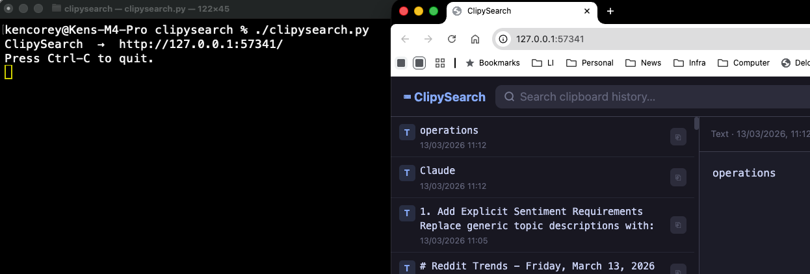

# ClipySearch

Browse and search your [Clipy](https://clipy-app.com) clipboard history in a fast, dark-themed browser UI.



## Features

- Two-pane UI — scrollable list on the left, full content on the right
- Image thumbnails in the list; full-size image preview in the detail pane
- Live updates — new clipboard entries appear at the top without a page reload
- Full-text search across all clipboard history
- Copy any entry back to the clipboard with one click
- Keyboard navigation (↑ ↓ arrows, Enter to copy, Esc to clear search)
- Fixed URL (`http://127.0.0.1:57341`) — reuse the same browser tab across restarts
- Auto-quits when the browser tab is closed
- Kills any previous instance on startup so the terminal process is always in control

## Requirements

- **macOS** (uses `sips`, `osascript`, and `pbcopy` — all built in)
- **Python 3.6+** — the system Python at `/usr/bin/python3` works fine; no pip installs needed
- **[Clipy](https://clipy-app.com)** installed and running

No third-party dependencies.

## Installation

```bash
git clone https://github.com/yourname/clipysearch.git
cd clipysearch
chmod +x clipysearch.py
```

## Usage

```bash
./clipysearch.py
```

Opens (or focuses) a browser tab at `http://127.0.0.1:57341`.

### Search from the command line

```bash
./clipysearch.py python snippet
```

Opens the UI with the search field pre-filled with `python snippet`.

### Quit

- **Close the browser tab** — the server detects the close and exits within ~1 second.
- **Ctrl-C** in the terminal — broadcasts a shutdown notice to the browser tab, then waits 30 seconds for a relaunch request before exiting.

### Relaunch without leaving the tab

Press Ctrl-C in the terminal. A "ClipySearch stopped" overlay appears in the browser with a **🔄 Relaunch** button. Clicking it restarts the server and reloads the page automatically.

Running `./clipysearch.py` again from any terminal also works — it kills the previous instance and takes over.

## How it works

Clipy stores each clipboard entry as an Apple binary property list (`*.data`) in:

```
~/Library/Application Support/Clipy/
```

ClipySearch decodes these files using Python's built-in `plistlib`, extracts text and images from the `NSKeyedArchiver` format, converts TIFF images to PNG via the built-in `sips` tool, and serves everything through a single-file HTTP server with a self-contained HTML/JS UI.

Server-Sent Events (SSE) keep the browser in sync with new clipboard entries as they arrive.

## File structure

```
clipysearch.py   # The entire application — one file, zero dependencies
README.md
```

## License

GNU General Public License v3.0 (GPL-3.0) — copyleft. Any derivative works must be distributed under the same license with source code available.
