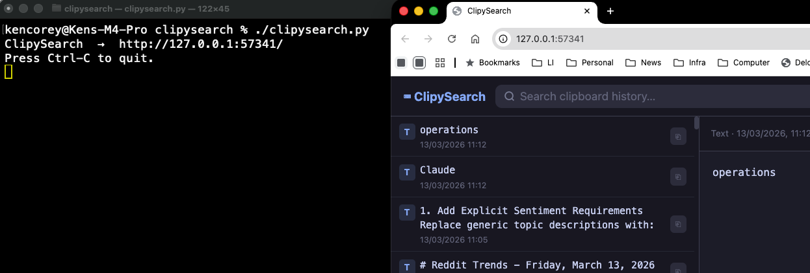

# ClipySearch

Native macOS menu bar app to browse and search your [Clipy](https://clipy-app.com) clipboard history. Sits in the menu bar with minimal memory, opens a native AppKit search window on click.



## Features

- Lives in the menu bar — no Dock icon (LSUIElement)
- Native AppKit window — no browser, no HTML
- Two-pane UI: searchable list + content preview (text or full image)
- Full-text search across clipboard history
- Live updates via DispatchSource directory watching
- Keyboard-first: arrows navigate, Enter copies + closes, Esc clears or closes
- Right-click menu bar icon for Reload / Quit
- Lazy load — parses Clipy data only when window opens; idle RSS ~45 MB
- Single self-contained `.app` bundle, ~240 KB

## Requirements

- macOS 12+ (Apple Silicon or Intel)
- [Clipy](https://clipy-app.com) installed and capturing clips
- Xcode Command Line Tools (`xcode-select --install`) to build from source

> Tested with Clipy v1.2.1 on macOS.

## Build

```bash
git clone https://github.com/kcorey/clipysearch.git
cd clipysearch
./build.sh
```

Produces `build/ClipySearch.app`. Install with:

```bash
cp -R build/ClipySearch.app /Applications/
open /Applications/ClipySearch.app
```

## Usage

- Click the magnifying-glass icon in the menu bar to open the search window
- Type to filter; arrows to navigate; Enter to copy the selected item and close
- Esc clears the search; Esc again closes the window
- Right-click the menu bar icon for **Reload Now** / **Quit ClipySearch**

The window auto-hides when it loses focus.

## How it works

Clipy stores each clipboard entry as an `NSKeyedArchiver` binary property list (`*.data`) in:

```
~/Library/Application Support/Clipy/
```

ClipySearch parses these files with `PropertyListSerialization`, walks the `$objects` graph (resolving `CFKeyedArchiverUID` refs via KVC), and classifies each entry as text / URL / image / files. Images are reconstituted from `NSTIFFRepresentation` via `NSImage(data:)`. Copy-back uses `NSPasteboard.general` directly.

A `DispatchSource` file system observer watches the Clipy data directory; reloads coalesce within 250 ms to avoid churn during bursts.

## File structure

```
Sources/
  main.swift                    Entry point
  AppDelegate.swift             NSStatusItem, window lifecycle, context menu
  ClipyParser.swift             NSKeyedArchiver plist decoder
  ClipyStore.swift              Item cache + directory watcher
  SearchWindowController.swift  NSWindow + NSSearchField + NSTableView
Info.plist                      LSUIElement, bundle metadata
build.sh                        swiftc → .app bundle
clipysearch.py                  Legacy Python/browser version (kept as reference)
```

## Legacy Python version

The original Python + HTTP-server + browser version is still in `clipysearch.py`. Run with `./clipysearch.py` if you prefer the browser UI. The Swift app supersedes it.

## License

GNU General Public License v3.0 (GPL-3.0) — copyleft. Any derivative works must be distributed under the same license with source code available.
